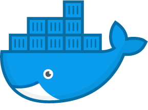

# Docker Resources [↩](README.md#top)

<table style="font-family:Helvetica,Arial;line-height:1.6;">
  <tr>
  <td style="border:0;padding:0 10px 0 0;min-width:100px;"></td>
  <td style="border:0;padding:0;vertical-align:text-top;">This document gathers <a href="https://www.docker.com/" rel="external">Docker</a> related resources that caught our attention.
  </td>
  </tr>
</table>

## Articles

- [15 Docker Command You Should Know][article_hale] by Jeff Hale, February 2019.

## Blogs

- [Kubernetes vs Docker in 2024: Which Container Orchestration Platform Should You Choose?](https://cloud.folio3.com/blog/kubernetes-vs-docker/) by Obaid ur Rehman, February 2024.
- [Docker Images : Part III - Going Farther To Reduce Image Size][blog_images_3], by Jérônme Petazzoni, April 2020.
- [Docker Images : Part II - Details Specific To Different Languages][blog_images_2], by Jérôme Petazzoni, February 2020.
- [Docker Images : Part I - Reducing Image Size][blog_images_1], by Jérôme Petazzoni, February 2020.
- [3 Different Ways to Provide Docker Build Context][blog_build_context], by Ben Cane, September 2017.

## Books [**&#x25B4;**](#top)

-  [Docket Deep Dive][book_poulton] by Nigel Poulten, June 2023.
- [A Complete Guid to Docker for Operations and Development][book_fouda] by Engy Fouda, 2022. (Apress, ISBN 978-1-4842-8116-1, 199 pages)
- [Mastering Docker][book_mckendrick] (4th Edition) by Russ McKendrick, 2020. (Packt, ISBN 978-1-83921-657-2, 568 pages)
- [Docker in Practice][book_miell] (2nd Edition) by Ian Miell and Aidan Hobson Sayers, February 2019. (Manning, ISBN  978-1-6172-9272-9, 370 pages)
- [Learning Docker][book_singh] (2nd Edition) by Vinod Singh et al., May 2017. (Packt, ISBN 978-1-7864-6292-3, 240 pages)
- [Docker Networking Cookbook][book_langemak] by Jon Langemak, November 2016. (Packt, ISBN 978-1-78646-114-8, 377 pages)
- [Docker Cookbook][book_goasguen] by Sébastien Goasguen, December 2015. (O'Reilly, ISBN 978-1-491-91971-2, 359 pages)

## Tutorials

- [What Is Docker? Understanding Its Components and How It Works in 2024](https://www.hostinger.co.uk/tutorials/what-is-docker), by M. Ariffud, January 2024.
- [DockerLabs Tutorials](https://dockerlabs.collabnix.com) :
  - Docker for [Beginners](https://dockerlabs.collabnix.com/beginners/README.html), [Intermediate](https://dockerlabs.collabnix.com/intermediate/README.html) and [Avdanced](https://dockerlabs.collabnix.com/advanced/README.html).
  - [The Ultimate Docker Cheat Sheet](https://dockerlabs.collabnix.com/docker/cheatsheet/).

***

*[mics](https://lampwww.epfl.ch/~michelou/)/January 2025* [**&#9650;**](#top)
&nbsp;

<!-- link refs -->

[article_hale]: https://towardsdatascience.com/15-docker-commands-you-should-know-970ea5203421
[blog_build_context]: https://www.cloudbees.com/blog/3-different-ways-to-provide-docker-build-context
[blog_images_1]: https://www.ardanlabs.com/blog/2020/02/docker-images-part1-reducing-image-size.html
[blog_images_2]: https://www.ardanlabs.com/blog/2020/02/docker-images-part2-details-specific-to-different-languages.html
[blog_images_3]: https://www.ardanlabs.com/blog/2020/04/docker-images-part3-going-farther-reduce-image-size.html
[book_fouda]: https://www.amazon.com/dp/1484281160
[book_goasguen]: https://www.oreilly.com/library/view/docker-cookbook/9781491919705/
[book_langemak]: https://www.packtpub.com/product/docker-networking-cookbook/9781786461148
[book_mckendrick]: https://
[book_miell]: https://www.manning.com/books/docker-in-practice-second-edition
[book_poulton]: htpps://
[book_singh]: https://www.packtpub.com/product/learning-docker-second-edition/9781786462923
